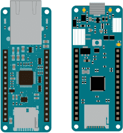
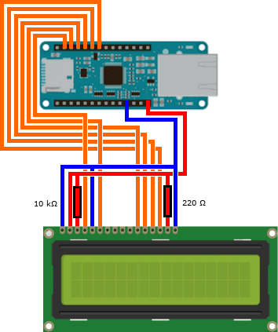

# EKönyv

Egy Arduino MKRZERO-n és ETH shield-en futó szerver, ami könyvekről tárol
adatokat és ISBN kódokat kérdez le; egy Android alkalmazás backend-je.

## Kábelezés

1. MKR Zero és MKR ETH Shield csatlakoztatása:\

2. MKR modul és 16x2 LCD összekötése:\

## Roadmap

- [x] Csatlakozás DHCP-re
- [x] HTTP szerver és útelválasztás
- [x] SD-kártya I/O
- [x] Event loop (~~fizikai → LCD frissítés~~ (később) → DHCP → bejövő →
      eventek)
- [x] Adatok veszteségmentes _?_ tárolása az SD-kártyán
  - [x] Fájlkezelés
- [x] Regisztráció négyjegyű kóddal
- [x] Idő lekérdezése NTP szerverről
- [x] Felhasználók jelszavainak SHA-256 titkosítása
- [x] Bejelentkezés session token-ért
- [x] Session token ellenőrzése védett API végpontokon
- [ ] ~~ISBN-lekérdezés API végpont~~
  - [ ] ~~Csak felhasználókra szűkítve~~
  - [ ] ~~Lekérdezés (3-4 HTTP GET)~~
  - [ ] ~~Ideiglenes tárolás~~
  - [ ] ~~Adat visszaküldése HTTP-n~~
- [x] Könyv API végpont
  - [x] (+ permission-ök)
  - [x] Lekérdezés API végpont
  - [x] Szerkesztés végpont
  - [x] Törlés végpont
- [x] Felhasználónév végpont
  - [x] Lekérdezés
  - [x] Változtatás
- [x] LCD UI; alapvető adatok kiírása, ~~2-3 bemenet~~
  - [x] IP-cím kiírása az LCD-re
  - [x] API-kulcs a felhasználóknak LCD-s bejelentkeztetéssel
